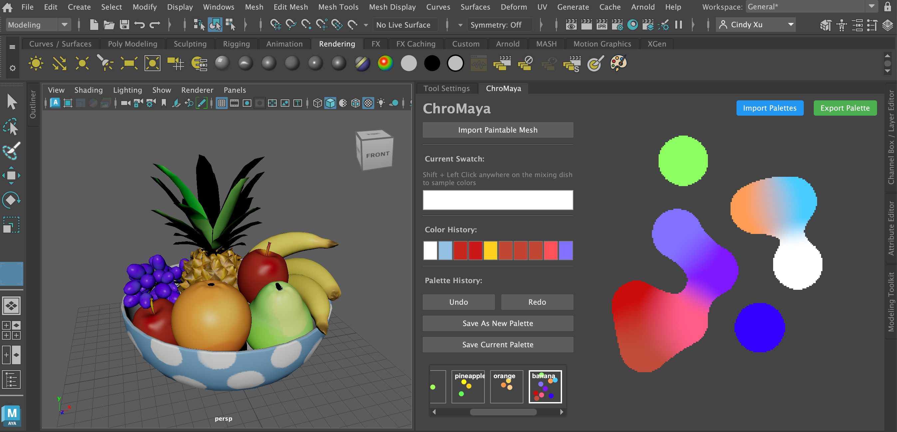

# ChroMaya: Interactive Color Picker Plugin for Maya 🎨

ChroMaya is a custom Autodesk Maya plugin that introduces an intuitive, artist-friendly color mixing and 3D painting workflow, inspired by the paper **_Playful Palette: An Interactive Parametric Color Mixer for Artists_** by Maria Shugrina (University of Toronto), Jingwan Lu (Adobe Research), and Stephen DiVerdi (Adobe Research).

This tool brings a digital painting experience closer to traditional media by allowing artists to mix and select colors through movable, blendable “blobs” that form custom gamuts. With ChroMaya, we reenvision the 3D texture painting workflow with our dynamic color picking and palette creation interface.

This project was built by Cindy Xu and Insha Lakhani as a final project for CIS 6600: Advanced Topics in Computer Graphics and Animation at the University of Pennsylvania.
